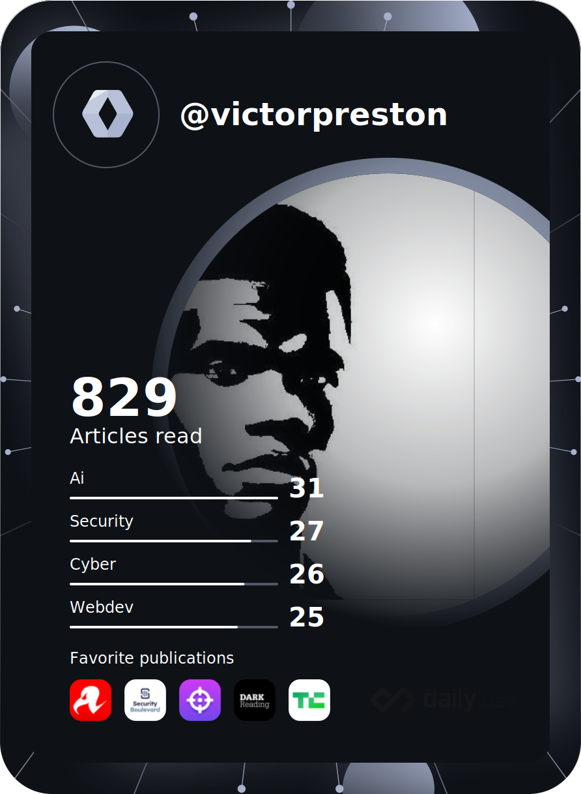

[](https://en.wikipedia.org/wiki/Open_source)


<a href="https://twitter.com/vpreston254" target="_blank" rel="noopener noreferrer">
  
</a>
<a href="https://www.linkedin.com/in/victor-preston-273054253/" target="_blank">
  
</a>
<a href="https://codepen.io/victorpreston" target="_blank">
  
</a>

```groovy
~ neofetch

                  ......                     victorpreston@github
            .::############::.               --------------------
        .:######################:.           OS: Linux, CentOS, Windows
     .:############################:.        Role: Software Engineer 
   .:#####´`³################³´`####:.       Uptime: 2 years +
  .#######.   `´´        ``´   .#######.     Packages: 54 (github), 23 (aur)
 .########:                    :########.
.########´                      `########.   Language Skills: Python / Java / C / C++ / Go Lang
:########                        ########:   Unix Skills: POSIX Shell / Bash / AWK / Regex / Perl
.########.                      .########.   Web Skills: HTML / CSS / JavaScript / PHP  
 .########:.                  .:########.    Text Formatting Skills: TeX / roff
  .############:..      ..:############.     Other Language Skills: TIBasic / Batch
    .###. `³####´        `###########.
      `###:. `³´          #########`         Languages_spoken: ["en_US", "es_ES"]
        `³######          ######³´
            `³³´          `³³´               Website: "https://victorpreston.tech"
                                             Technologies: Linux, Docker, Splunk, Graylog, ArcSight
                                             Cloud: Oracle, Azure, AWS
                                             Databases Skills: Oracle, MySQl, SQLite, MongoDB, Cassandra

                                             Blogs: Dev
                                             Contacts: [prestonvictor25@gmail.com, +254743575434]

```

--------
<a href="https://app.daily.dev/victorpreston">
 </a>


<div align="center">
  <a href="https://github.com/victorpreston/github-readme-stats"></a>
</div>
<div>                
 <p align="center">
    <a href="https://github.com/geeky-prashant/github-readme-streak-stats">
        
    </a>
</p>
</div>


<p align="center">
        
</p>        

<a href="https://twitter.com/vpreston254">
  
</a>
<a href="https://www.facebook.com/victor.preston.925?_rdc=1&_rdr">
  
</a>
<a href="https://www.linkedin.com/in/victor-preston-273054253/">
  
</a>
<a href="https://codepen.io/victorpreston">
  
</a>

| &nbsp;&nbsp;&nbsp; Website & Gallery : [https://victorpreston.tech] &nbsp;&nbsp;&nbsp;|&nbsp;&nbsp;&nbsp; Open Source Work : <sub>&#9660; &#9660; &#9660;</sub>


